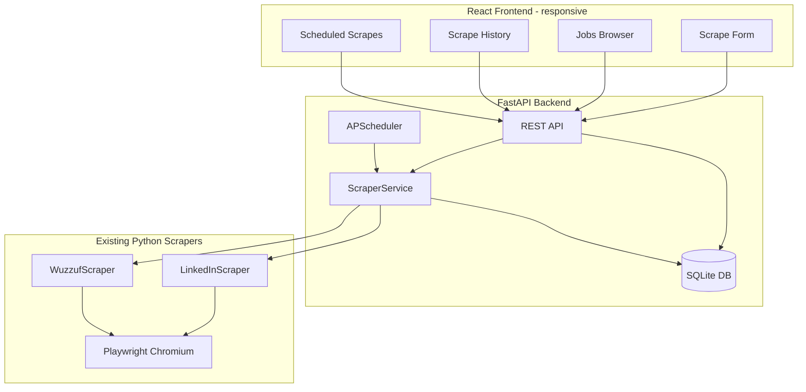
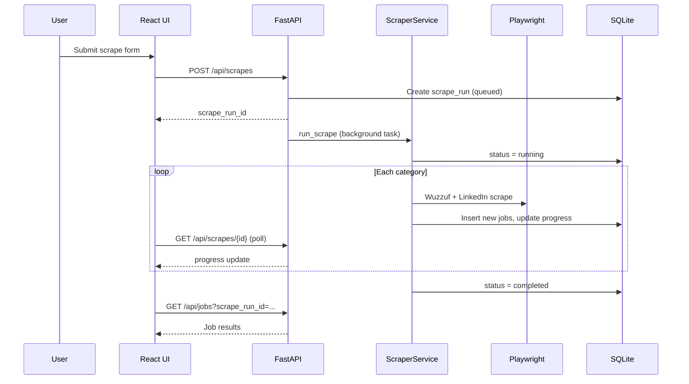

# Job Scraper Web App Plan

## Context

You already have a working CLI scraper at [`c:\Scraping-tool`](c:\Scraping-tool):

- [`scrapers/linkedin.py`](c:\Scraping-tool\scrapers\linkedin.py) and [`scrapers/wuzzuf.py`](c:\Scraping-tool\scrapers\wuzzuf.py) use Playwright
- [`models.py`](c:\Scraping-tool\models.py) defines the `JobListing` schema
- [`categories.json`](c:\Scraping-tool\categories.json) provides a parent/child category tree (e.g. Creative & Design → Graphic Design)
- Sample output [`creative_and_design_jobs_final.csv`](c:\Scraping-tool\creative_and_design_jobs_final.csv) has **496 jobs** with columns: `title, description, salary, type, company, category, country, applyLink, location, status`

The web app will **wrap this existing logic**, not replace it. The CLI in [`main.py`](c:\Scraping-tool\main.py) stays usable.

---

## Target Architecture



---

## Proposed Project Structure

Add these folders/files alongside existing code:

```
c:\Scraping-tool\
├── api/
│   ├── main.py                 # FastAPI entry + CORS
│   ├── database.py             # SQLAlchemy + SQLite
│   ├── models_db.py            # ScrapeRun, Job, ScheduledScrape tables
│   ├── schemas.py              # Pydantic request/response models
│   ├── routes/
│   │   ├── categories.py       # GET /categories (from categories.json)
│   │   ├── scrapes.py          # POST /scrapes, GET /scrapes/{id}
│   │   ├── jobs.py             # GET /jobs with filters + pagination
│   │   ├── exports.py          # GET /exports/csv|json
│   │   └── schedules.py        # CRUD scheduled scrapes
│   └── services/
│       ├── scraper_service.py  # Wraps existing scrapers + dedupe
│       └── scheduler_service.py
├── web/                        # React + Vite + Tailwind
│   ├── src/pages/
│   │   ├── ScrapePage.tsx
│   │   ├── JobsPage.tsx
│   │   ├── HistoryPage.tsx
│   │   └── SchedulesPage.tsx
│   └── src/components/
│       ├── CategoryPicker.tsx
│       ├── JobCard.tsx
│       ├── JobTable.tsx
│       └── ScrapeProgress.tsx
├── scrapers/                   # existing (minor tweaks)
├── models.py                   # existing JobListing
├── categories.json             # existing
└── main.py                     # existing CLI (unchanged)
```

---

## Data Model

### Jobs table (persist scraped results)

| Column | Source | Notes |
|--------|--------|-------|
| id | auto | Primary key |
| title, description, salary, type, company, category, country, applyLink, location, status | `JobListing` | Match CSV schema exactly |
| source | new | `linkedin` or `wuzzuf` |
| scrape_run_id | new | FK to scrape session |
| scraped_at | new | Timestamp |

**Dedup rule:** unique on `applyLink` (same as CLI `seen_links` logic in [`main.py`](c:\Scraping-tool\main.py) lines 80-103).

### Scrape runs table (history + progress)

| Column | Purpose |
|--------|---------|
| id, status | `queued`, `running`, `completed`, `failed` |
| config | JSON: categories, location, pages, platforms |
| progress | current category, jobs found, error message |
| started_at, finished_at | timing |

### Scheduled scrapes table

| Column | Purpose |
|--------|---------|
| id, name, enabled | user-defined schedule |
| cron_expression | e.g. `0 8 * * 1` (every Monday 8am) |
| config | same shape as manual scrape form |

---

## Backend Implementation

### 1. Extract shared scraping logic from CLI

Refactor [`main.py`](c:\Scraping-tool\main.py) into a reusable `ScraperService` so both CLI and API call the same code:

```python
# api/services/scraper_service.py (conceptual)
def run_scrape(config, on_progress) -> ScrapeResult:
    # load categories from categories.json
    # launch Playwright (headless)
    # for each category: scrape Wuzzuf + LinkedIn
    # dedupe by applyLink
    # persist jobs + update scrape_run progress
```

- Run Playwright in a **thread pool** (`asyncio.to_thread`) because existing scrapers use sync Playwright API
- Emit progress callbacks so the API can update `scrape_runs.progress`
- Add `source` field to `JobListing` (small change in [`models.py`](c:\Scraping-tool\models.py))

### 2. FastAPI endpoints

| Endpoint | Purpose |
|----------|---------|
| `GET /api/categories` | Return parent → children tree from `categories.json` |
| `POST /api/scrapes` | Start scrape (returns `scrape_run_id`) |
| `GET /api/scrapes` | List past runs (history page) |
| `GET /api/scrapes/{id}` | Status + progress (polled every 2-3s while running) |
| `GET /api/jobs` | Paginated jobs with filters: `q`, `source`, `category`, `company`, `location`, `scrape_run_id`, date range |
| `GET /api/jobs/{id}` | Full job detail (long descriptions) |
| `GET /api/exports/csv` | Download filtered jobs as CSV (same columns as sample) |
| `GET /api/exports/json` | Download filtered jobs as JSON |
| `POST /api/import/csv` | One-time import of existing `creative_and_design_jobs_final.csv` |
| `GET/POST/PATCH/DELETE /api/schedules` | Manage scheduled scrapes |

### 3. Scheduled scraping

Use **APScheduler** started on FastAPI app startup:

- Load enabled schedules from DB
- On trigger: create a new `scrape_run` and call `ScraperService.run_scrape`
- Expose cron presets in UI: daily, weekly, custom

### 4. Minor scraper improvements

- Add `source` tagging in [`linkedin.py`](c:\Scraping-tool\scrapers\linkedin.py) and [`wuzzuf.py`](c:\Scraping-tool\scrapers\wuzzuf.py)
- Extend [`exporter.py`](c:\Scraping-tool\exporter.py) with `to_csv()` (currently JSON-only) for API export reuse
- Map category IDs to names on save (reuse logic from [`map_categories.py`](c:\Scraping-tool\map_categories.py))

### 5. New Python dependencies

Add to [`requirements.txt`](c:\Scraping-tool\requirements.txt):

```
fastapi
uvicorn[standard]
sqlalchemy
apscheduler
python-multipart
```

---

## Frontend Implementation (Mobile + Desktop)

**Stack:** React + Vite + Tailwind CSS (responsive-first, no separate mobile app needed).

### Pages

1. **Scrape** (`/`)
   - Parent category dropdown → multi-select subcategories (from `categories.json` tree)
   - Free-text keyword override (optional)
   - Location (default: Egypt), pages per platform, platform toggles (LinkedIn / Wuzzuf)
   - "Start Scrape" button → live progress panel (status, current category, job count)
   - Disable form while scrape is running

2. **Jobs** (`/jobs`)
   - **Mobile:** stacked `JobCard` components (title, company, location, source badge, expand for description)
   - **Desktop:** sortable table with truncated description + row click for detail drawer/modal
   - Filters: search box, source, category, company, location, date
   - Pagination (25/50 per page)
   - Export CSV / JSON buttons (respects active filters)

3. **History** (`/history`)
   - List of past scrape runs with status, duration, jobs found, config summary
   - Click a run → filter Jobs page to that run

4. **Schedules** (`/schedules`)
   - Create/edit/delete recurring scrapes
   - Enable/disable toggle
   - Show last run + next run time

### Responsive design rules

- Single-column layout below `md` breakpoint; sidebar nav collapses to bottom tab bar on mobile
- Touch-friendly buttons (min 44px tap targets)
- Job descriptions in scrollable panels (avoid page overflow from long text like in sample CSV)
- Sticky filter bar on Jobs page

---

## Data Flow for a Manual Scrape



---

## Implementation Phases

### Phase 1 — Backend foundation (days 1-2)
- SQLite schema + SQLAlchemy models
- `ScraperService` extracted from CLI
- Core API: categories, start scrape, poll status, list jobs
- Import existing sample CSV into DB for immediate UI testing

### Phase 2 — Frontend MVP (days 2-4)
- Vite + React + Tailwind scaffold in `web/`
- Scrape form + progress polling
- Jobs browser with filters, cards/table responsive layout
- CSV/JSON export

### Phase 3 — History + schedules (days 4-5)
- History page wired to scrape runs
- APScheduler integration
- Schedules CRUD UI

### Phase 4 — Polish + hardening (day 5-6)
- Error states (LinkedIn blocked, timeout, empty results)
- Loading skeletons, empty states
- README with run instructions
- Optional: serve React build from FastAPI static files for single-command deploy

---

## Running Locally (target developer experience)

```bash
# Terminal 1 — API
cd c:\Scraping-tool
.\venv\Scripts\activate
pip install -r requirements.txt
playwright install chromium
uvicorn api.main:app --reload --port 8000

# Terminal 2 — Frontend
cd c:\Scraping-tool\web
npm install
npm run dev
```

- API: `http://localhost:8000`
- UI: `http://localhost:5173` (proxies `/api` to backend)

---

## Risks and Mitigations

| Risk | Mitigation |
|------|------------|
| LinkedIn blocks headless scraping | Show clear error in UI; add retry + delay; allow Wuzzuf-only runs |
| Scrapes take minutes (per-job description fetch) | Background jobs + progress polling; don't block HTTP request |
| Long multiline descriptions break CSV | Use pandas `to_csv` with proper quoting (already proven in sample CSV) |
| Playwright not installed on new machine | Document `playwright install chromium` in README |
| Duplicate jobs across runs | Enforce unique `applyLink` in DB |

---

## Out of Scope (for v1)

- User authentication / multi-tenant access
- Cloud deployment (can add later: Docker + Railway/Render)
- LinkedIn login / authenticated scraping
- Real-time WebSockets (polling is sufficient for v1)
